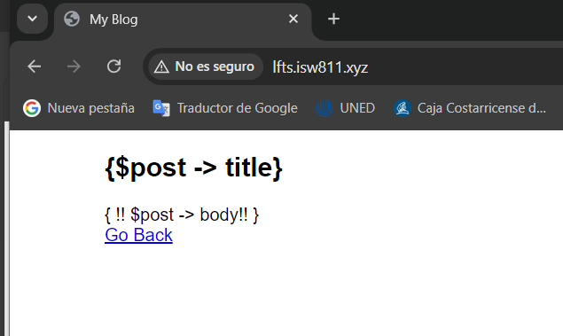
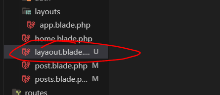
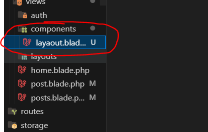
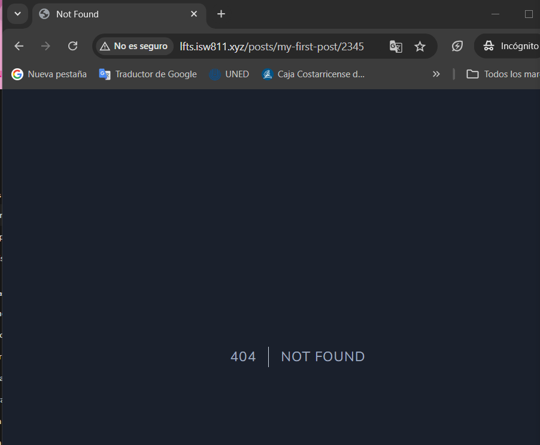

## BLADE


El capítulo sobre Blade en la serie "Laravel 8 From Scratch" de Laracasts cubre el sistema 
de plantillas que ofrece Laravel, llamado Blade. Blade es un motor de plantillas simple pero
poderoso que permite escribir vistas en Laravel de una manera más eficiente, usando 
características como directivas, herencia de plantillas, y componentes.

-----------------------------------------------------
 ## Episode 14- Blade: The Absolute Basics
-----------------------------------------------------
Volvemos a iniciar la maquina:
``` bash
cd webserver
vagrant up
```
En este proceso de aprendizaje, se pudo observar que la manipulación del HTML a través de un archivo
.blade.php es considerablemente más sencilla en comparación con un archivo solo en php. Esto permite
simplificar el código de manera significativa, facilitando el desarrollo y la legibilidad durante la programación.

Ingresamos a post.blade.php y modificamos el codigo:
``` bash
<!DOCTYPE html>
<link rel="stylesheet" href="app.css">
<title>My Blog</title>
<body> 
    <?php foreach ($posts as $post): ?>
        <article class= "{{ $loop->even ? 'foobar' : ''}}">
            <h1>
                <a href="/posts/{{ $post->slug }}">
                    {{ $post->title }}
                </a>
            </h1>
            <div>
            {{ $post->title }}
            </div>
        </article>
        @endforeach
</body>
</html>
```
Al igual ingresamos a post.blade.php y modificamos el codigo:

``` bash
<!DOCTYPE html>
<link rel="stylesheet" href="/app.css">
<title>My Blog</title>
<body> 
    <article>
        <h1>{$post -> title}</h1>
            <div>
                { !! $post -> body!! }
            </div>
    </article>
    <a href= "/">Go Back</a>
</body>
```
Los cambios se deben de visaulizar de la siguiente manera:


-----------------------------------------------------
 ## Episode 15- Layout Tow Days
-----------------------------------------------------
 Se implementó una estructura que
 permite mantener todo ordenado y reducir la cantidad de código. Esto se logró al evitar el uso de elementos
 como @section, sustituyéndolos simplemente por la etiqueta x-layout, la cual incluye todo el contenido de
 nuestra página.

A continuacion procedemos a crear un archivo llamado:
layout.blade.php


Luego creamos una carpeta en view llamada components y movemos el archivo layout.blade.php



Luego  modificamos los post.blade.php

``` bash
<x-layout>
@foreach ($posts as $post)
    <article class= "{{ $loop->even ? 'foobar' : ''}}">
        <h1>
            <a href="/posts/{{ $post->slug }}">
                {{ $post->title }}
            </a>
        </h1>
        <div>
            {{ $post->title }}
        </div>
    </article>
        @endforeach
</x-layout>
```
```bash
<x-layot>
<article>
        <h1>{$post -> title}</h1>
            <div>
                { !! $post -> body!! }
            </div>
    </article>
    <a href= "/">Go Back</a>
</x-layot>

```
-----------------------------------------------------
 ## Episode 16- A few Tweaks and consideration
-----------------------------------------------------

 En este capítulo, se aprendera cómo crear un diseño base o layout para la aplicación y reutilizarlo en diferentes vistas, sin necesidad de repetir el código HTML.Ademas, cómo establecer una estructura común para tus páginas (por ejemplo, con encabezados y pies de página) y cómo inyectar contenido dinámico en diferentes secciones del layout. Es útil para mantener un código limpio y fácil de mantener.

 Modificamos el codigo de models/post.php:
 ``` bash
<?php

namespace App\Models;
use Iluminate\Database\Eloquent\ModelNotFoundException;
use Illuminate\Support\Facades\File;
use Spatie\YamlFrontMatter\YamlFrontMatter;

class Post{
    public $title;
    public $excerpt;
    public $date;
    public $body;

    public function __construct($title, $excerpt, $date, $body, $slug){
        $this->title = $title;
        $this->excerpt = $excerpt;
        $this->date = $date;
        $this->body = $body;
        $this->slug = $slug;
    }

    public static function all()
    {
        return cache()->rememberForever('posts.all', function(){
            return collect(File::files(resource_path("posts")))
            ->map(fn ($file) => YamlFrontMatter::parseFile($file))
            ->map( fn($document)=> new Post(
                $document->title,
                $document->excerpt,
                $document->date,
                $document->body(),
                $document->slug
            ))
            ->sortByDesc('date');
        });

    }

    public static function find ($slug){
 
    return static::all()->firstWhere('slug', $slug);

    }
    public static function findOrFail($slug){
        $post = static::find($slug);

        if(! $post){
            throw new ModelNotFoundException();
        }
        return $post;
    }
}
 ```
Y tambien web.php:
``` bash
<?php

use App\Models\Post;
use Illuminate\Support\Facades\Route;
use Illuminate\Support\Facades\File; 
use Spatie\YamlFrontMatter\YamlFrontMatter;

Route::get('/', function () {

    return view('posts', [
        'posts' => Post::all()
    ]);
    
});

Route::get('posts/{post}', function ($slug) {
    $post = Post::findOrFail($slug);
    return view('post',[
        'post' => $post
    ]);
});

Auth::routes();

Route::get('/home', [App\Http\Controllers\HomeController::class, 'index'])->name('home');
```
Resultado:

