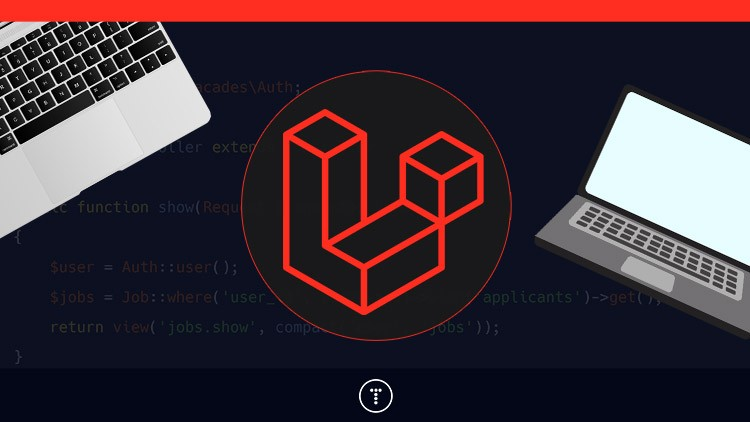

## Proyecto Laravel from scratch


## Module 1 - The Basics
1. Antes de iniciar debemos de preparar nuestro ambiente de trabajo.


2. Iniciamos la maquina virtual:

```bash
cd VMs
cd webserver
vagrant up
```
## Capitule 5 
-------------------------------------------
###  Episode 5- How a route Loads a View
-------------------------------------------

*Este episodio nos presenta lo que podemos modificar de la pagina que esta por defecto de LARAVEL.*

Una vez iniciado la maquina de webserver, ingresamos desde visual a la carpeta de lfts.isw811.xyz en resources/views/welcome.blade.php y modificamos el siguiente codigo:

1. Ingresamos aqui:


 
2. Modificamos la linea 71:

```bash
 <strong>Laracasts offers thousands of video tutorials on Laravel, PHP, and JavaScript development. Check them out, see for yourself, and massively level up your development skills in the process.</strong>
```
3. Guardamos, refrescamos la pagina y se debe ver asi:


4. Es importante resaltar que este código define una ruta en Laravel que, al visitar la URL principal (/), carga la vista welcome. Es la página de bienvenida por defecto de Laravel la cual se encuentra en routes/web.php:

```bash
Route::get('/'function ()){
    return view('welcome');

Luego creamos un nuevo folder llamado app.css y dentro de el ecribimos el siguiente codigo:

``` bash
body{
    background: navy;
    color: white;
}
```
Vamos nuevamente a resources/views/welcome.blade.php y hacemos el llamado de app.css:


Refrescamos la pagina y se debe visualizar asi:


Luego creamos un nuevo folder llamado app.js y agregamos el siguiente cod y de igual manera hacemos la llamada en resources/views/welcome.blade.php:

``` bash
alert('I am here');
```


Al refrescar la pgina debe visaulizarse asi:


---------------------------------------------
###  Episode 7- Make a Route and Link to it
---------------------------------------------
Ingresamos nuevamente a routes/ web.php y modificamos el siguiente codigo:

``` bash
Route::get('/', function () {
    return view('posts');
});
```
Luego Ingresamos nuevamente a resources/ welcome.bland.php y cambiamos el nombre:


Ahora no es  welcome.bland.php sino posts.bland.php

Se elimina el ejemplo de creacion de carpeta de app.js y eliminamos igual el llamdo en posts.blade.php

Modificamos el css:
``` bash
body{
    background: white;
    color: black;
}
```
Debe visualizarse asi:


Modificamos el posts.blade.php al igual que el css:


Los cambios deben de visualizarse de la suguiente manera:


Luego volvemos a routes/web.php y agregamos el siguiente codigo para agregar un link de la propia pagina que estamos creando:


Ingreamos a posts.blade.php y modificamos lo siguiente para poder acceder al link:


Debe verse asi:


Para que funcione el link como se debe debemos de agregar en views otro folder llamado post.blade.php y agregamos lo siguiente:

``` bash
<!DOCTYPE html>

<title>My Blog</title>
<link rel="stylesheet" href="app.css">

<body> 
    <article>
        <h1><a href="/post">My firt post</a></h1>
            <p>
                Example my first post Karen Jimenez
                Hello world
            </p>
        
    </article>

    <a href="/">Go back</a>
</body>
```
Y ahora al ingresar al link debe visualizarse de la siguiente manera:


En este episodio de puede aprender sobre como agregar links, modificar y agregar codigo de html y css e interactuar con varios posts.

---------------------------------------------
###  Episode 8- Store Blog Posts as HTML Files
---------------------------------------------
Seguidamente modificamos el post.blade.php

``` bash
<title>My Blog</title>
<link rel="stylesheet" href="app.css">
<body> 
    <article>
        
        <?= $post; ?> 

    </article>

    <a href="/">Go back</a>
</body>
```

Y modificamos tambien en web.php para que funcione correctamente:

``` bash
Route::get('/', function () {
    return view('posts');
});

Route::get('post', function () {
    return view('post', ['post'=> '<h1> Hello World</h1>']);
});
```
Debe verse asi al ingresar:


Luego creamos un nievo folder dentro de resources llamado posts y dentro de el creamos 3 folders con los nombres: my-first-post.html, my-second-post.html, my-third-post.html
Agregamos su respectivo html:
``` bash
<!DOCTYPE html>

<title>My Blog</title>
<link rel="stylesheet" href="app.css">

<body> 
    <article>
        <h1><a href="/post">My third post</a></h1>
            <p>
                Example my third post Karen Jimenez
            </p>
        
    </article>

</body>
```
Luego nos vamos a web.php y modificamos el codigo para validar las rutas que acabamos de crear:

``` bash
Route::get('/', function () {
    return view('posts');
});

Route::get('posts/{post}', function ($slug) {
    $post = file_get_contents(__DIR__ . "/../resources/posts/{$slug}.html");


    return view('post', ['post'=> $post]);
});

```
Al refrescar la pagina con su respectiva ruta dependiendp del posts debe verse asi:


Ya realizado este cambio procedemos a modificar nuevamente el web.php:

``` bash
Route::get('/', function () {
    return view('posts');
});

Route::get('posts/{post}', function ($slug) {
    $path = __DIR__ . "/../resources/posts/{$slug}.html";

    if(! file_exists($path)){
        return redirect('/');
        //abort (404)
    }
    
    $post = file_get_contents($path);

    return view('post', ['post'=> $post]);
});
```
El cambio lo podemos ver ingresando desde la web en http://lfts.isw811.xyz/posts/my-other-post


Seguidamente procedemos a modificar el codigo de  posts.blade.php que creamos:

``` bash
<!DOCTYPE html>

<title>My Blog</title>
<link rel="stylesheet" href="app.css">

<body> 
    <article>
        <h1><a href="/posts/my-first-post">My firts post</a></h1>
            <p>
                Example my first post Karen Jimenez
            </p>
        
    </article>

    <article>
        <h1><a href="/posts/my-second-post"> My second post</a></h1>
            My second post
            <p>
                Example my second post Karen Jimenez
            </p>
    </article>

    <article>
        <h1><a href="/posts/my-third-post"> My third post</a></h1>
            My third post
            <p>
                Example my third post Karen Jimenez
            </p>
    </article>
</body>

```
Hecho esto al ingresar a second post debe verse el contenido del segundo post, del first post debe verse el contenido del primer post y asi sucesivamente.


---------------------------------------------
###  Episode 9- Route Wildcard Constraints 
---------------------------------------------
Para lograr la resticcion debemos de agregar en web.php el  siguiente codigo:

El código 
```bash
->where('post', '[A-z]+');
```
 Es una restricción de ruta en Laravel que se utiliza para aplicar expresiones regulares a los parámetros de la URL.

El método 
``` bash
->whereAlpha('post');
```
 es una forma más simple y clara de aplicar una restricción en las rutas de Laravel para aceptar solo caracteres alfabéticos (letras) en un parámetro de la URL, similar a usar expresiones regulares.

 ``` bash
  ->whereAlphaNumeric('post');
  ```
Se usa para asegurarte de que el parámetro post solo contenga caracteres alfabéticos y numéricos.

Nuestro codigo en web.php debe verse asi

``` bash
Route::get('/', function () {
    return view('posts');
});

Route::get('posts/{post}', function ($slug) {
    $path = __DIR__ . "/../resources/posts/{$slug}.html";

    if(! file_exists($path)){
        return redirect('/');
        //abort (404)
    }
    
    $post = file_get_contents($path);

    return view('post', ['post'=> $post]);
})->where('post', '[A-z_\-]+');
```
-----------------------------------------------------
 ## Episode 10- Use Caching for Expensive Operations 
-----------------------------------------------------
Ingresamos nuevamente a web.php y modificamos el codigo de la siguiente manera:
``` bash

Route::get('/', function () {
    return view('posts');
});

Route::get('posts/{post}', function ($slug) {
    $path = __DIR__ . "/../resources/posts/{$slug}.html";

    if(! file_exists($path)){
        return redirect('/');
        //abort (404)
    }

    $post = cache()->remember("posts. {$slug}", 5, function () use ($path){
        var_dump('file_get_contents');
        return file_get_contents($path);
    });
    

    return view('post', ['post'=> $post]);
})->where('post', '[A-z_\-]+');

```
Al refrescar la pagina se debe ver asi:


``` bash
 $post = cache()->remember("posts. {$slug}", 5, function () use ($path){
        var_dump('file_get_contents');
        return file_get_contents($path);
    })
```
Este código busca almacenar en caché el contenido de un archivo por 5 minutos para evitar accesos repetidos al archivo. Si la caché no existe o ha expirado, el contenido se carga nuevamente desde el archivo, se almacena en la caché y luego se devuelve.

Volvemos a modificar el codigo:

``` bash
Route::get('/', function () {
    return view('posts');
});

Route::get('posts/{post}', function ($slug) {
    $path = __DIR__ . "/../resources/posts/{$slug}.html";
    
    if (!file_exists($path)) {
        return redirect('/');
    }

    $post = cache()->remember("posts.{$slug}", 1200, fn() => file_get_contents($path));

    return view('post', ['post' => $post]);
})->where('post', '[A-z_\-]+');

```
-----------------------------------------------------
 ## Episode 11- Use the Filessystem Class to Read a Directory
-----------------------------------------------------
Modificamos los html que habiamos creado quitando las rutas de los titulos.

``` bash
        <h1>My first post</h1>
```
Asi deben quedar los titulos.
Luego modificamos nuevamente el codigo de web.php:

``` bash
Route::get('/', function () {
    return view('posts');
});

Route::get('posts/{post}', function ($slug) {
    //find a post by its slug and pass it to a view called "post"
    $post = Post::find($slug);

    return view ('post', [
        'post'=> $post
    ]);
    
    //$path = __DIR__ . "/../resources/posts/{$slug}.html";
    
    ///if (!file_exists($path)) {
     //   return redirect('/');
    //}

    //$post = cache()->remember("posts.{$slug}", 1200, fn() => file_get_contents($path));

    //return view('post', ['post' => $post]);
})->where('post', '[A-z_\-]+');
```
En resumen, el código muestra el contenido de un post según su slug en la URL.

Para que esto sea funcional necesitamos crear un Models el cual debemos de nombrar: Post.php


Luego ingresamos el siguiente codigo:

``` bash
<?php

namespace App\Models;

class Post{
    public static function find ($slug){

    if (!file_exists($path= resource_path("posts/{$slug}.html"))){
        throw new ModelNowFoundException();
    }
    
    return cache()->remember("posts.{$slug}", 1200, fn() => file_get_contents($path));

    }

}
```
Y hacemos el llamado del MODELS en web.php 

``` bash
use App\Models\Post;
```
Luego modificamos nuevamente el codigo de web.php:
``` bash
Route::get('/', function () {
    return view('posts');
});

Route::get('posts/{post}', function ($slug) {
    
    return view ('Post', [
        'post'=> Post::find($slug)
    ]);
    
})->where('post', '[A-z_\-]+');

```
Luego modificamos post.blade.php:

``` bash
<!DOCTYPE html>

<title>My Blog</title>
<link rel="stylesheet" href="/app.css">

<body> 

<?php foreach ($posts as $post) : ?>
    <article>
        <?= $post; ?>
        </article>
    <?php endforeach; ?>
</body>
</body>
```
Al igual debemos de mofificar codigo en web.php:
``` bash
<?php
use App\Models\Post;
use Illuminate\Support\Facades\Route;

/*
|--------------------------------------------------------------------------
| Web Routes
|--------------------------------------------------------------------------
|
| Here is where you can register web routes for your application. These
| routes are loaded by the RouteServiceProvider within a group which
| contains the "web" middleware group. Now create something great!
|
*/

Route::get('/', function () {
    return view('posts', [
        'posts'=> Post::all()
    ]);
});

Route::get('posts/{post}', function ($slug) {
    
    return view ('post', [
        'post'=> Post::find($slug)
    ]);
    
})->where('post', '[A-z_\-]+');


Auth::routes();

Route::get('/home', [App\Http\Controllers\HomeController::class, 'index'])->name('home');

```
Y modificar codigo de Models/Post.php, se debe ver asi:
``` bash
<?php

namespace App\Models;
use Iluminate\Database\Eloquent\ModelNotFoundException;
use Illuminate\Support\Facades\File;

class Post{

    public static function all()
    {
        $files = File::files(resource_path("posts/"));

        return array_map(fn($file) => $file->getContents(), $files);

    }

    public static function find ($slug){

    if (!file_exists($path= resource_path("posts/{$slug}.html"))){
        throw new ModelNowFoundException();
    }
    
    return cache()->remember("posts.{$slug}", 1200, fn() => file_get_contents($path));

    }
}
```
Con estos cambios el navegador se debe visualizar de la siguiente manera:


Ahora creamos otro folder my-fourth-post.html y de igual manera al refrescar deberia de mostrarse.
 
-----------------------------------------------------
 ## Episode 12- Find a Composer Package for Post Metadata
-----------------------------------------------------
Ingresamos a VMs/webserver/sites/lfts.isw811.xyz en bash:
``` bash
vagrant up
vagrant ssh
```
E instalamos lo siguiente:
``` bash
$:composer require spatie/yaml-front-matter
```
Ya instalado se debe visualizar asi:


Luego ingresamos a web.php y modificamos el codigo:
``` bash
<?php

use App\Models\Post;
use Illuminate\Support\Facades\Route;
use Illuminate\Support\Facades\File; 
use Spatie\YamlFrontMatter\YamlFrontMatter;

Route::get('/', function () {

    return view('posts', [
        'posts' => Post::all()
    ]);
    
});

Route::get('posts/{post}', function ($slug) {
    return view('post', [
        'post' => Post::find($slug)
    ]);
})->where('post', '[A-z_\-]+');

Auth::routes();

Route::get('/home', [App\Http\Controllers\HomeController::class, 'index'])->name('home');

```
Al igual que el codigo de Post.php:

``` bash
<?php

namespace App\Models;
use Iluminate\Database\Eloquent\ModelNotFoundException;
use Illuminate\Support\Facades\File;
use Spatie\YamlFrontMatter\YamlFrontMatter;

class Post{
    public $title;
    public $excerpt;
    public $date;
    public $body;

    public function __construct($title, $excerpt, $date, $body, $slug){
        $this->title = $title;
        $this->excerpt = $excerpt;
        $this->date = $date;
        $this->body = $body;
        $this->slug = $slug;
    }

    public static function all()
    {
        return collect(File::files(resource_path("posts")))
        ->map(fn ($file) => YamlFrontMatter::parseFile($file))
        ->map( fn($document)=> new Post(
            $document->title,
            $document->excerpt,
            $document->date,
            $document->body(),
            $document->slug
        ));

    }

    public static function find ($slug){
 
    return static::all()->firstWhere('slug', $slug);

    }
}
```
Y los post.blade.php:
``` bash
<!DOCTYPE html>
<link rel="stylesheet" href="app.css">
<title>My Blog</title>
<body> 
    <?php foreach ($posts as $post): ?>
        <article>
            <h1>
                <a href="/posts/<?= $post->slug; ?>">
                    <?= $post->title; ?>
                </a>
            </h1>
            <div>
            <?= $post->$excerpt; ?>
            </div>
        </article>
        <?php endforeach; ?>
</body>
```
``` bash
<!DOCTYPE html>

<title>My Blog</title>
<link rel="stylesheet" href="/app.css">

<body> 

<?php foreach ($posts as $post) : ?>
    <article>
        <h1><?= $post ->title;?></h1>
        </article>
    <?php endforeach; ?>
</body>

```
Al realizar los cambios se debe visualizar de la siguiente manera en el navegador:


-----------------------------------------------------
 ## Episode 13- Collrction Sorting and Caching Refresher
-----------------------------------------------------
Seguidamente nos vamos a Post.php y modificamos el codigo de la siguiente manera:

Modificamos el siguiente codigo:
``` bash

    public static function all()
    {
        return cache()->rememberForever('posts.all', function(){
            return collect(File::files(resource_path("posts")))
            ->map(fn ($file) => YamlFrontMatter::parseFile($file))
            ->map( fn($document)=> new Post(
                $document->title,
                $document->excerpt,
                $document->date,
                $document->body(),
                $document->slug
            ));
            ->sortByDesc('date');
        });

    }
```
Debe de visualizarse asi.
Luego ingresamos a la terminal y corremos el siguiente codigo:

``` bash
vagrant@webserver:/vagrant/sites/lfts.isw811.xyz$ php artisan tinker

```


Seguidamente creamos posts/my-fiyh-post.html
y Comprobamos en la web, debe verse asi:

